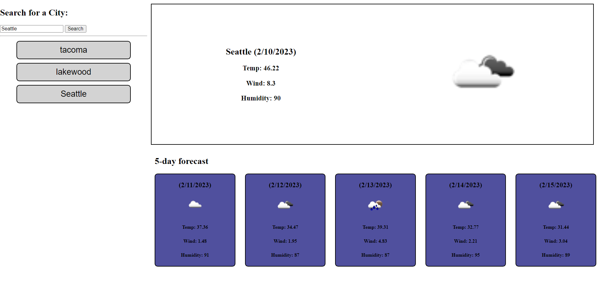

# Weather-Dash

## Screenshot

## Usage
Upon loading the landing page, you will see on the top left an option to seach for a city, when you type in any city name and click on the search button. This will populate current weather on the top right showing the Temp, Wind and Humidity with a lovely image of todays forcast. Below, on the bottom right will give you a five day advance of the weather forcast. This will save any previous search city history, so you can click on them to look back at the city's weather. 
## Built With
 * Api
 * Javascript
 * HTML
 * CSS
 * Local Storage
## Resources 
https://openweathermap.org/forecast5

## Contact Me
* [Sabina Ceja-Siete](https://github.com/unisabi)
## License
See `MIT LICENSE` for more information.
## Deployment

